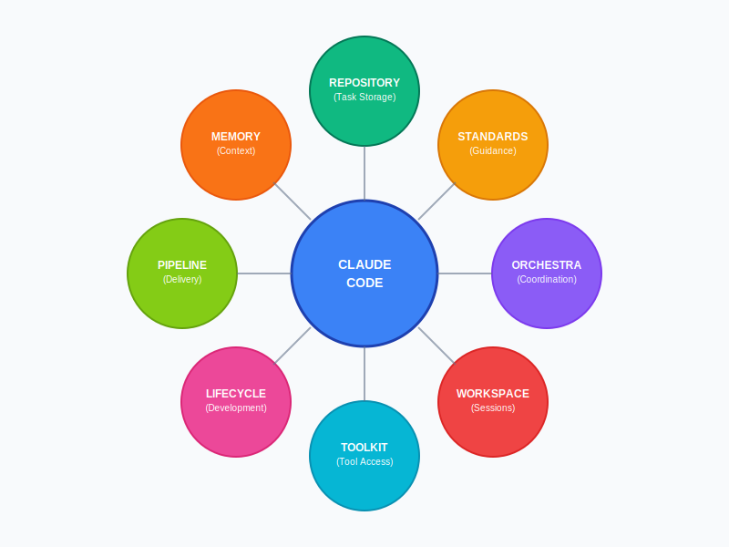

# 8 Requirements for Successful Agentic Coding With Claude Code

*The core framework for AI-powered development*

---

## 1. REPOSITORY - Task Storage

Claude needs a reliable source of truth for what work needs to be done. Tasks must live somewhere Claude can access them and you can trace their progress.

**Implementation Options:**
- **Markdown Backlogs:** Simple todo lists in markdown format
- **Structured Text:** Product specifications that convert into actionable tasks  
- **Issues/Tickets:** GitHub Issues or Jira tickets tied to code reviews

**Examples:** [Backlog.md](https://github.com/MrLesk/Backlog.md), [ReqText](https://github.com/fred-terzi/reqtext), [ccpm](https://github.com/automazeio/ccpm)

---

## 2. STANDARDS - Guidance Framework

Replace ambiguous prompts with clear, repeatable structure. Claude performs better when the rules and expectations are explicitly defined.

**Key Components:**
- **Command Libraries:** Prebuilt slash commands like /create-tasks, /review
- **Coding Standards:** Clear tech stack and coding guidelines
- **Definition of Done:** Encoded completion criteria
- **Validation Hooks:** Automatic linting and testing enforcement

**Takeaway:** Claude does better work when the rules are clear and repeatable.

---

## 3. ORCHESTRA - Agent Coordination

When multiple AI agents work together, they need clear roles and coordination to avoid stepping on each other and maximize efficiency.

**Coordination Strategies:**
- **Role Simulation:** AI as PM, architect, developer, and tester
- **Swarm Parallelism:** Multiple agents in structured workflows (spec → pseudocode → code → tests)
- **Repo-native Artifacts:** Persistent memory through stored tasks, logs, and ADRs

**Examples:** [MetaGPT](https://github.com/FoundationAgents/MetaGPT), [Claude-Flow](https://github.com/ruvnet/claude-flow), [Roo Commander](https://github.com/jezweb/roo-commander)

---

## 4. WORKSPACE - Session Management

AI output can get messy without proper session management. Organize your workstation setup to run tasks in parallel without constant collisions.

**Workspace Solutions:**
- **Terminal Orchestration:** Claude controls commands, panes, and logs
- **Parallel Worktrees:** Multiple Git branches running simultaneously
- **Isolated Containers:** Separate environments to prevent conflicts

**Examples:** [Symphony](https://github.com/sincover/Symphony), [Claude-Squad](https://github.com/smtg-ai/claude-squad), [Crystal](https://github.com/stravu/crystal), [ClaudeBox](https://github.com/RchGrav/claudebox)

---

## 5. TOOLKIT - Tool Access

Transform Claude from "smart autocomplete" into an active teammate by providing access to your entire development stack and validation systems.

**Tool Categories:**
- **MCP Integrations:** Model Context Protocol servers for browsers, databases, test runners, UI automation
- **Custom Tool Libraries:** Built-in shell scripts and commands
- **Database Access:** Direct database interaction capabilities (e.g., Supabase integration)
- **Testing Hooks:** Automated test runners (Vitest, Jest) and validation loops

**Examples:** [SuperClaude](https://github.com/SuperClaude-Org/SuperClaude_Framework), [Symphony](https://github.com/sincover/Symphony), [Claudable](https://github.com/opactorai/Claudable), [Agent OS](https://github.com/buildermethods/agent-os)

---

## 6. LIFECYCLE - Development Process

Claude can wear different hats throughout the software development lifecycle, from project management to testing and code review.

**Development Roles:**
- **Project Manager:** Convert product specs into tasks and backlogs
- **Architect:** Design structure, define interfaces, set conventions
- **Implementer:** Write code within established guardrails
- **Tester:** Run unit tests and UI checks via MCP servers
- **Reviewer:** Audit PRs for quality, readability, and risk

**Examples:** [Playwright MCP](https://github.com/microsoft/playwright-mcp) for UI testing

**Takeaway:** Leverage AI at each step of the software lifecycle.

---

## 7. PIPELINE - Code Delivery

Choose your deployment scale based on your needs - from safe iteration for production systems to full app scaffolds for rapid prototyping.

**Delivery Methods:**
- **Small Diffs:** AI creates small, reviewed PRs from tickets
- **Feature Experiments:** Deploy changes behind feature flags
- **Full App Scaffolds:** Build and deploy entire applications from high-level prompts

**Examples:** [ai-ticket](https://github.com/jmikedupont2/ai-ticket), [Claudable](https://github.com/opactorai/Claudable)

**Takeaway:** Pick your scale—safe iteration for production, scaffolds for prototypes.

---

## 8. MEMORY - Context Preservation

Claude forgets between sessions, but frameworks can remember. Without memory, AI repeats mistakes. With memory, it compounds progress.

**Memory Systems:**
- **Documentation:** Keep CLAUDE.md, architecture notes, and project journals fresh
- **Persistent Memory:** Recap recent work and run project health checks
- **Decision Logs:** Store architectural decisions and reasoning (ADRs)

**Examples:** [Claude Conductor](https://github.com/superbasicstudio/claude-conductor), [Claude-Flow](https://github.com/ruvnet/claude-flow)

**Takeaway:** Without memory, AI repeats mistakes. With memory, it compounds progress.

---

## Key Insight

**AI works best when you give it structure.** Claude isn't replacing developers—it's shifting their roles toward higher-value activities like architecture, design, and project management.

The frameworks are converging on a future where AI is not a magic box but a set of teammates you manage. The more structure you provide, the more value you get back.

---

*Based on insights from [Claude Code Framework Wars](https://shmck.substack.com/p/claude-code-framework-wars)*
